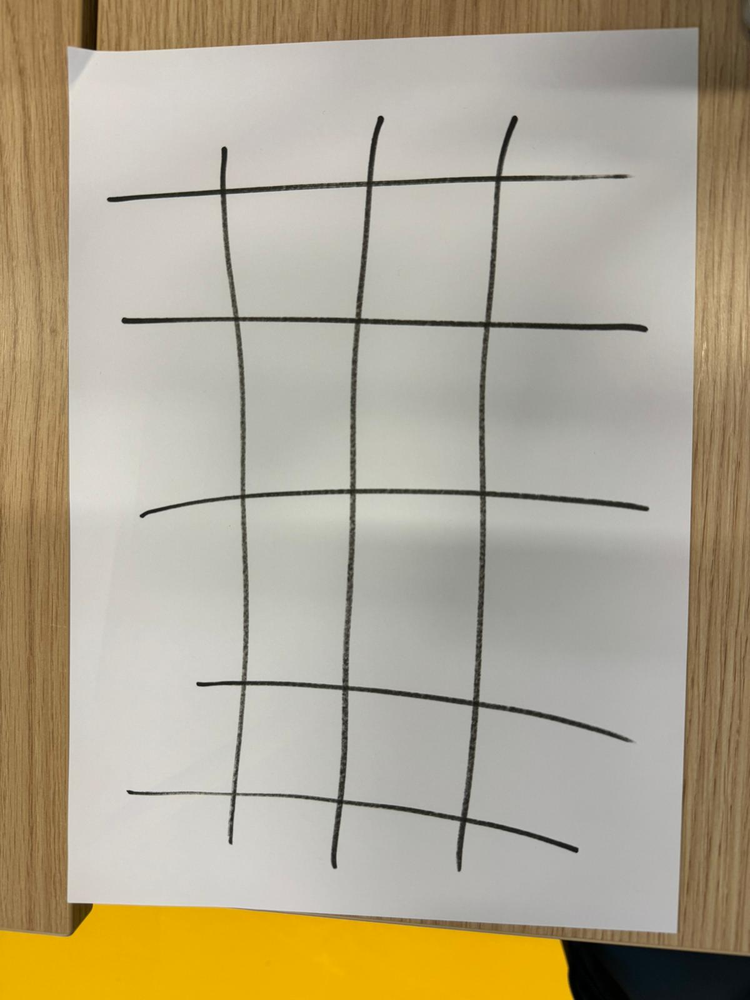
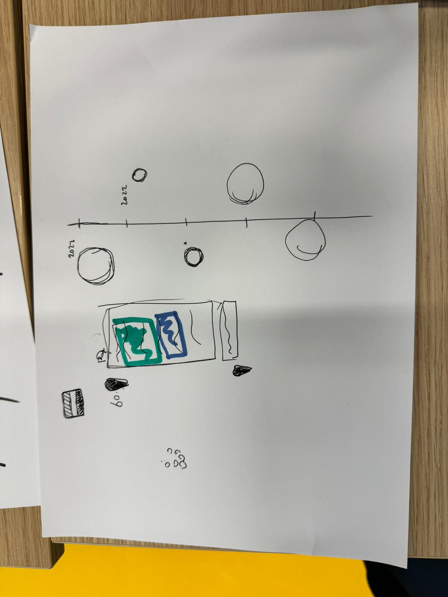
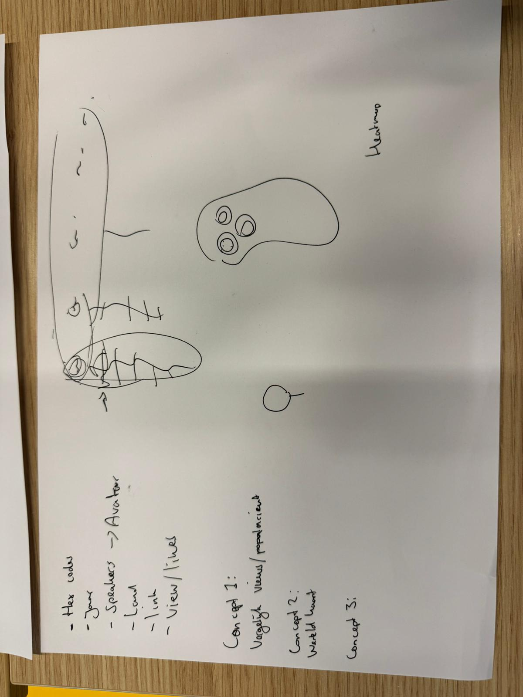
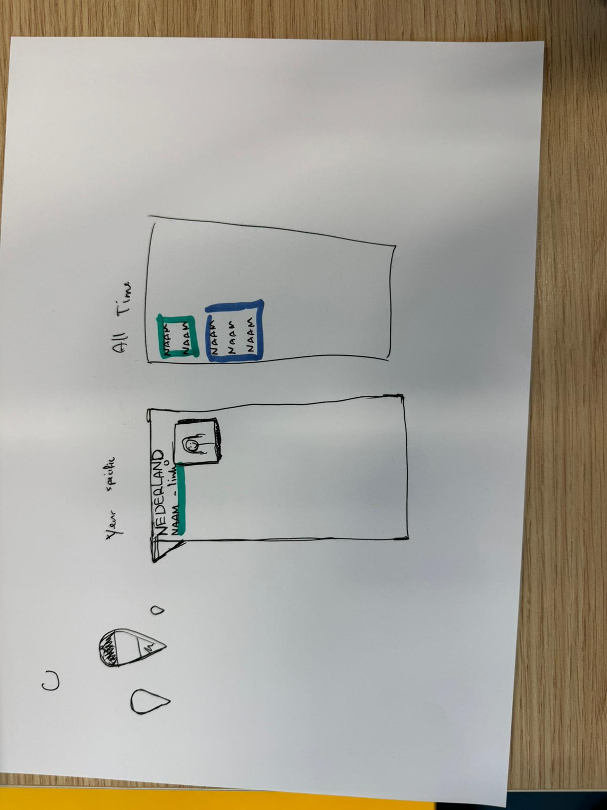
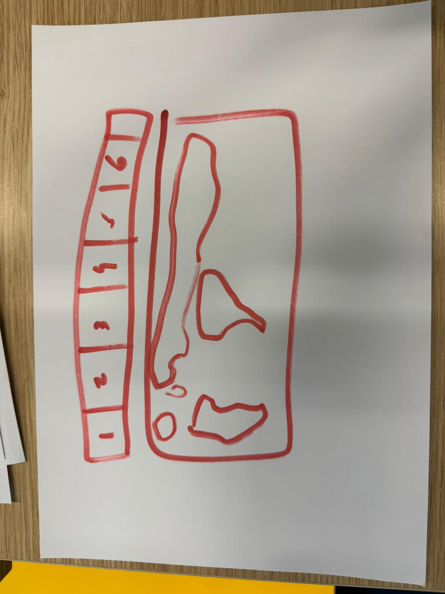

# CSS Day Hackaton

Voor de Hackaton is het de bedoeling dat we in groepjes voor een opdrachtgever een project gaan maken in 4 dagen. Onze groep genaamd "Taam 2" bestaat uit:

- Hidde
- Max
- Xiao nan
- Stephan

De opdrachtgever is Krijn Hoetmer, een organisator van CSS Day. Hij heeft een json voor ons bruikbaar gemaakt om alle data van CSS Day te kunnen gebruiken. In wat we deze data gaan gebruiken worden we volledig vrijgelaten.

Ons idee is om met de data van alle sprekers van alle jaren een kaart te maken om te zien waar de sprekers vandaan komen in de wereld met extra info over de spreker.

Data die wij gebruiken van speakers.json:
- Name
- Link
- Avatar
- Country

Misschien:
- Title
- Video link

## Schetsen

## Bronnen
- https://nl.vecteezy.com/vector-kunst/10158602-wereldkaart-achtergrond-grijze-kleur-met-nationale-grenzen
