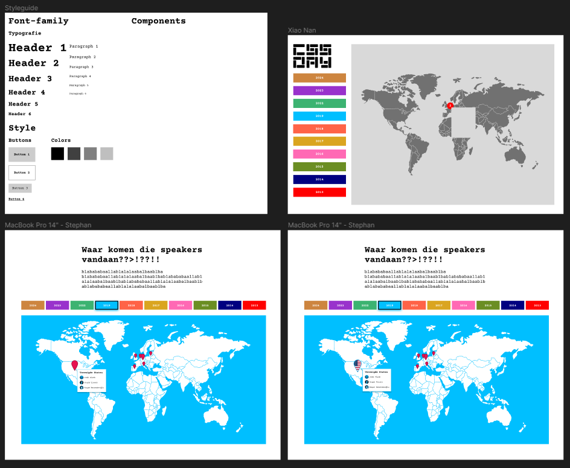
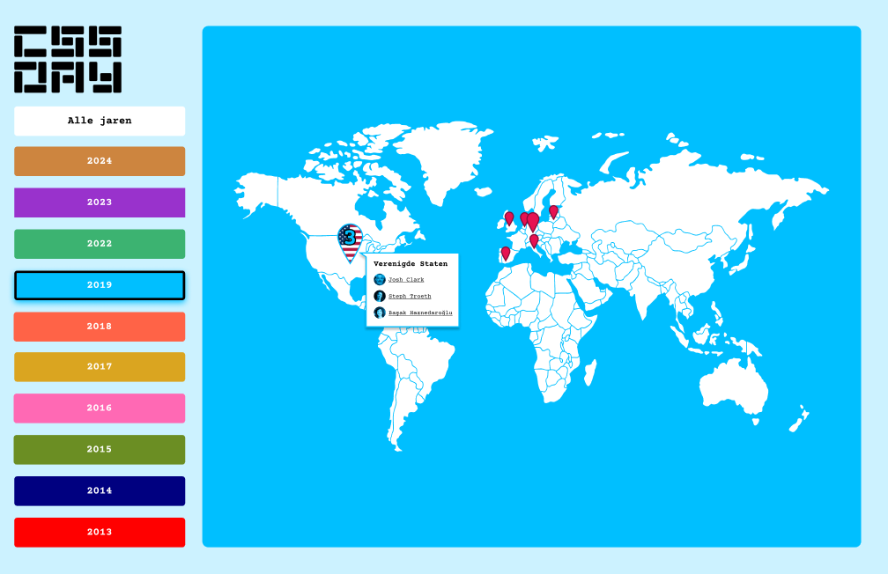

# CSS Day Hackaton

Voor de Hackaton is het de bedoeling dat we in groepjes voor een opdrachtgever een project gaan maken in 4 dagen. Onze groep genaamd "Taam 2" bestaat uit:

-   Hidde
-   Max
-   Xiao nan
-   Stephan

De opdrachtgever is Krijn Hoetmer, een organisator van CSS Day. Hij heeft een json voor ons bruikbaar gemaakt om alle data van CSS Day te kunnen gebruiken. In wat we deze data gaan gebruiken worden we volledig vrijgelaten.

Ons idee is om met de data van alle sprekers van alle jaren een kaart te maken om te zien waar de sprekers vandaan komen in de wereld met extra info over de spreker.

## Schetsen





Data die wij gebruiken van speakers.json:

-   Name
-   Link
-   Avatar
-   Country

Misschien:

-   Title
-   Video link

Dit zijn de functionaliteiten die we willen en de persoon die hieraan gaat werken:

-   Kaart met zoom en drag mogelijkheden - Hidde
-   Pins op de kaart voor het aantal sprekers per land van dat jaar - Max en Stephan
-   Informatie over de sprekers - Max en Stephan
-   Navigatie met knoppen om het jaar te selecteren - Xiao nan

## Functies

### Hidde

**Kaart met zoom en drag mogelijkheden**

We hebben besloten dat het mooi zou zijn als de gebruiker met de kaart kan zoomen en draggen zoals bij google maps. Hidde kreeg de taak om dit te onderzoeken. Als eerste ging hij op zoek naar manieren om dit te doen, het liefst met alleen html en css. Dit bleek al snel niet mogelijk. Er moest wel javascript bij gebruikt worden. Bij chat GPT heeft hij met de prompt: "How can i make a map zoomable and dragable with only html and css" deze code gekregen:

```css
.map-container {
    overflow: hidden;
    width: 500px; /* Adjust as needed */
    height: 300px; /* Adjust as needed */
}

#map {
    width: 100%;
    transition: transform 0.25s ease;
}

#map.zoomed {
    transform: scale(1.5); /* Adjust the scale factor as needed */
    cursor: grab;
}

#map.zoomed:active {
    cursor: grabbing;
}
```

Dit werkte alleen totaal niet zoals gewenst. Je kon namelijk niet goed draggen en het leek erop dat de zoom en pan gebeurde met hover.
Uiteindelijk is het geprobeerd met js maar dit werkte nog niet goed. Uiteindelijk gaf de Github Copilot de suggestie om de D3.js libary te gebruiken omdat die een makkelijke functie heeft om kaarten te kunnen zoomen en draggen.
Toen kreeg ik met de prompt: "how can i do this with d3.js" deze code:

```javascript
document.addEventListener('DOMContentLoaded', (event) => {
    const svg = d3.select('.mapSection').append('svg').attr('width', '100%').attr('height', '100%');

    const image = svg.append('image').attr('href', 'path_to_your_image').attr('width', '100%').attr('height', '100%');

    const zoom = d3
        .zoom()
        .scaleExtent([0.5, 4]) // This controls the min and max zoom levels
        .on('zoom', function () {
            image.attr('transform', d3.event.transform);
        });

    svg.call(zoom);
});
```

Samen met een beetje styling in de css is het gelukt om de kaart te zoomen en te draggen.

### Stephan

**Pins op de kaart voor het aantal sprekers per land van dat jaar**

**Informatie over de sprekers**

### Xiao Nan
**Buttons stylen**
In de HTML hebben we voor de buttons een input gebruikt zodat je makkelijk de active style kan toevoegen:
```html
<ul>
    <li>
        <label>
            <p>Show all</p>
            <input type="radio" name="years" value="Show all" />
        </label>
    </li>
    <li>
        <label>
            <p>2024</p>
            <input type="radio" name="years" value="2024" />
        </label>
    </li>
    <li>
        <label>
            <p>2023</p>
            <input type="radio" name="years" value="2023" />
        </label>
    </li>
</ul>
```

De button background-color komt uit de data van heet jaar. De kleuren wordt opgehaald uit de data en in een variable gezet. Dan worden de kleuren toegevoegd aan de properties in de CSS om de juiste kleur te krijgen. 
```js
// Get the colors of the years
const colorsByYear = {};
data.forEach(speaker => {
    const colorHex = speaker.edition.color.hex;
    const year = speaker.edition.year;

    if (!colorsByYear[year]) {
    colorsByYear[year] = colorHex;
    }
});

// Set background colors for each year
for (const [year, colorHex] of Object.entries(colorsByYear)) {
    const property = `--btn-${year}`;
    document.documentElement.style.setProperty(property, colorHex);
}
```

**Intro animatie**
Animatie begin scherm wordt toegevoegd. Dan met JavaScript wordt de animatie verwijdert na 3.5 sec. 

```js
function hideElement() {
  animationContainer.style.display = 'none';
  main.classList.remove("main-animation");

}
setTimeout(hideElement, 3500);
```

**No JavaScript**
Wanneer er geen JavaScript is, dan werkt de hele site niet. Maar dan is het wel mooi om te laten zien dat de JavaScript aan moet staat. Dus dan is er een waat moet je doen lijst voor Chrome, FireFox en Safari. 

```html
<section>
    <h3>Chrome</h3>
    <ol>
        <li>Open Chrome DevTools.</li>
        <li>Depending on your operating system, press one of the following: On Window or Linux, Control + Shift + P. On MacOS, Command + Shift + P. The Command Menu opens.</li>
        <li>Start typing javascript , select Disable JavaScript, and then press Enter to run the command. JavaScript is now disabled.</li>
    </ol>
</section>
```

### Max
**Navigatie met knoppen om het jaar te selecteren**

## Bronnen

-   https://nl.vecteezy.com/vector-kunst/10158602-wereldkaart-achtergrond-grijze-kleur-met-nationale-grenzen
